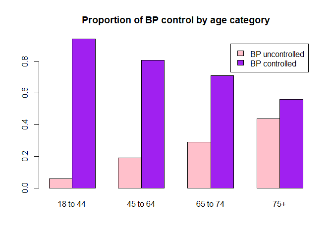
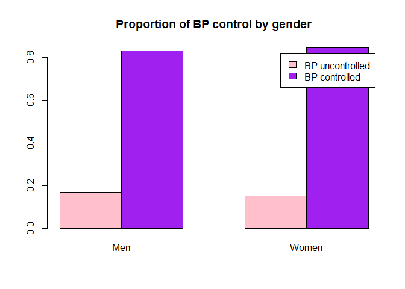
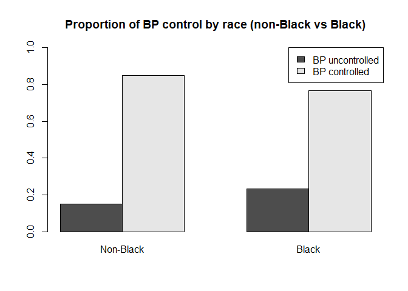
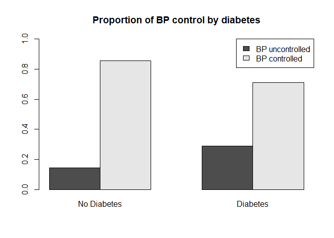
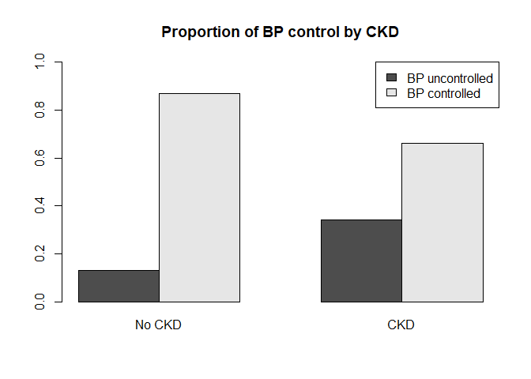
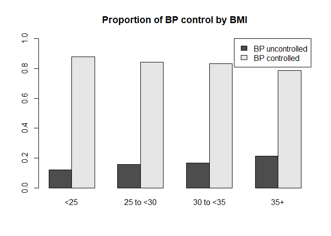
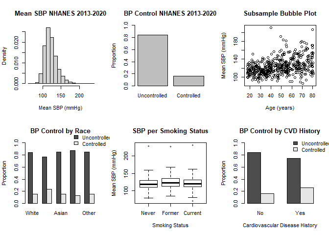
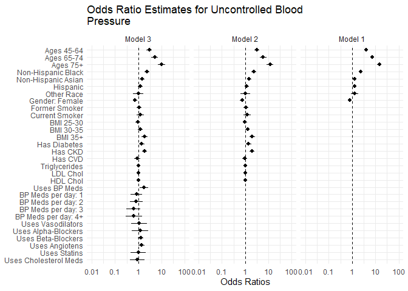
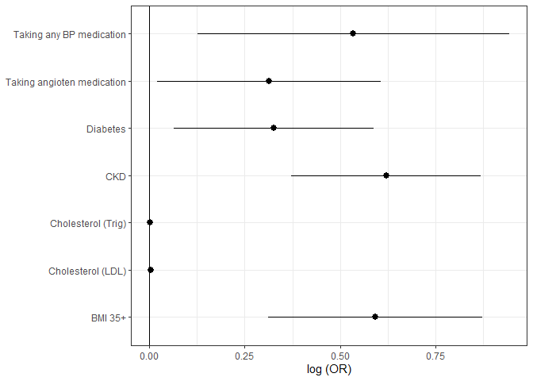
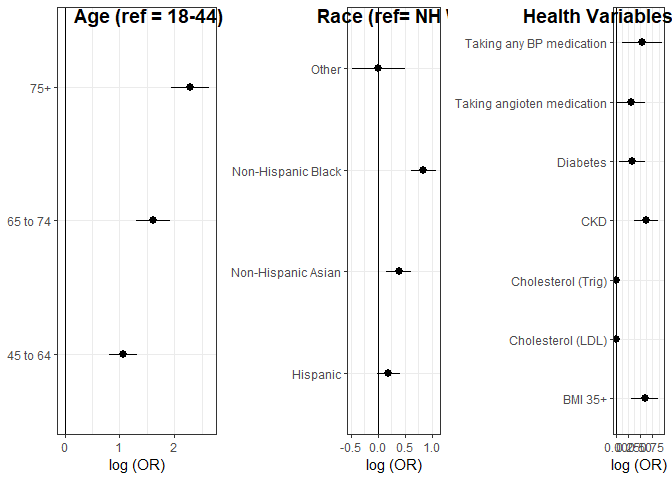

P8123 Final
================
Farizah Rob, Emily Potts, Harry Wang, William Anderson
2023-12-14

``` r
library(tidyverse)
library(survey)
library(ggsurvey)
library(tableone)
library(gtsummary)
library(sjPlot)

knitr::opts_chunk$set(
  message = FALSE,
  warning = FALSE,
  tidy.opts = list(width.cutoff = 60)
)

theme_set(theme_minimal() + theme(legend.position = "bottom"))


load("./data/nhanes_data.rda") #put files into data folder so everyone can run this
load("./data/nhanes_key.rda") 
load("./data/key_guide.rda")
```

**Problem statement:** Controlling blood pressure (BP) reduces the risk
for cardiovascular disease. However, the prevalence of BP control (i.e.,
systolic BP \< 140 and diastolic BP \< 90) among US adults with
hypertension has decreased since 2013. We invite teams to analyze
publicly available data from US adults to help identify potential causes
or correlates of worsening BP control among US adults with hypertension
over the past decade, as this may allow for development of effective
interventions to help control BP and prevent cardiovascular disease.

### Svydesign and subset for hypertension patients 2013 onwards

``` r
dstrat <- svydesign(ids=~svy_psu, strata=~svy_strata, weights=~svy_weight_mec, data=nhanes_data, nest=TRUE) 

htsub <- subset(dstrat, svy_subpop_htn==1) #limited to hypertension patients

htsub2 <- subset(htsub, svy_year=="2013-2014" | svy_year=="2015-2016" | svy_year=="2017-2020") #limited to hypertension patents from 2013 onwards
```

### Some EDA

The **outcome** of interest -\> **bp_control_140_90** OR
**bp_uncontrolled_140_90**

``` r
#age -> so for older people, BP control is definitely lower
age <- svyby(~factor(bp_control_140_90), ~factor(demo_age_cat), design=htsub2, svymean, na.rm=TRUE)
barplot(age, legend.text=c("BP uncontrolled", "BP controlled"), col=c("pink", "purple"), main="Proportion of BP control by age category") 
```

<!-- -->

``` r
#gender -> not really any difference 
gender <- svyby(~factor(bp_control_140_90), ~factor(demo_gender), design=htsub2, svymean, na.rm=TRUE)
barplot(gender, legend.text=c("BP uncontrolled", "BP controlled"), col=c("pink", "purple"), main="Proportion of BP control by gender") #not much of a change
```

<!-- -->

``` r
#race -> for Black people vs non-Black people, BP control is lower
race <- svyby(~factor(bp_control_140_90), ~factor(demo_race_black), design=htsub2, svymean, na.rm=TRUE)
barplot(race, 
        legend.text=c("BP uncontrolled", "BP controlled"), 
        names.arg=c("Non-Black", "Black"), 
        ylim=c(0, 1.0),
        args.legend = list(x = "topright"), 
        main="Proportion of BP control by race (non-Black vs Black)")
```

<!-- -->

``` r
#diabetes
diabetes <- svyby(~factor(bp_control_140_90), ~factor(cc_diabetes), design=htsub2, svymean, na.rm=TRUE)
barplot(diabetes, 
        legend.text=c("BP uncontrolled", "BP controlled"), 
        names.arg=c("No Diabetes", "Diabetes"), 
        ylim=c(0, 1.0),
        args.legend = list(x = "topright"), 
        main="Proportion of BP control by diabetes")
```

<!-- -->

``` r
#ckd
ckd <- svyby(~factor(bp_control_140_90), ~factor(cc_ckd), design=htsub2, svymean, na.rm=TRUE)
barplot(ckd, 
        legend.text=c("BP uncontrolled", "BP controlled"), 
        names.arg=c("No CKD", "CKD"), 
        ylim=c(0, 1.0),
        args.legend = list(x = "topright"), 
        main="Proportion of BP control by CKD")
```

<!-- -->

``` r
#bmi 
bmi <- svyby(~factor(bp_control_140_90), ~factor(cc_bmi), design=htsub2, svymean, na.rm=TRUE)
barplot(bmi, 
        legend.text=c("BP uncontrolled", "BP controlled"), 
        ylim=c(0, 1.0),
        args.legend = list(x = "topright"), 
        main="Proportion of BP control by BMI")
```

<!-- -->

``` r
#meds recommended -> 100% for those with uncontrolled BP
# look at med recommended and meds taken ratio by different subgroups?

table(nhanes_data$bp_med_recommended_jnc7, nhanes_data$bp_med_use) #48% of people recommended medication do not take medication
```

    ##      
    ##          No   Yes
    ##   No  37755     0
    ##   Yes  7062 14690

``` r
svyCreateCatTable(vars= c("bp_med_recommended_jnc7" ,"bp_med_use"), 
                  strata="demo_race", 
                  data=htsub2) #across all races, the % of med use is lower than % recommended -? this gap is highest for NH Black
```

    ##                                    Stratified by demo_race
    ##                                     Non-Hispanic White  Non-Hispanic Black
    ##   n                                 443841370.8         78256419.3        
    ##   bp_med_recommended_jnc7 = Yes (%) 156173388.2 (35.2)  33534720.2 (42.9) 
    ##   bp_med_use = Yes (%)              111473163.2 (25.1)  23255215.8 (29.7) 
    ##                                    Stratified by demo_race
    ##                                     Non-Hispanic Asian Hispanic          
    ##   n                                 37820092.9         105372525.4       
    ##   bp_med_recommended_jnc7 = Yes (%) 11080831.4 (29.3)  26424308.7 (25.1) 
    ##   bp_med_use = Yes (%)               6822774.8 (18.0)  15828214.5 (15.0) 
    ##                                    Stratified by demo_race
    ##                                     Other             p      test
    ##   n                                 24220134.3                   
    ##   bp_med_recommended_jnc7 = Yes (%) 8029041.0 (33.2)  <0.001     
    ##   bp_med_use = Yes (%)              5443707.4 (22.5)  <0.001

``` r
#for table 1 -> age category, gender, race, BMI, smoking status, diabetes, CKD, cholesterol, recommended medication use, medication use

# removed "bp_med_recommended_jnc7", "bp_med_recommended_accaha" for space

# didn't they say something in class about the Rao and Scott being wrong in R? not sure if we should include p-values here

# I don't think we should have p-values in the table 1 since we're not running models yet, just showing mean and standard deviation of the different covariates per outcome - Will

reset_gtsummary_theme()
theme_gtsummary_compact()
tab1 <- tbl_svysummary(data = htsub2, by = "bp_control_140_90", include = c("demo_age_cat", "demo_gender", "demo_race", "cc_bmi", "cc_ckd", "cc_diabetes", "cc_cvd_any", "bp_med_use", "chol_total", "chol_hdl", "chol_ldl", "chol_trig", "chol_med_use"),
                       label = list(demo_age_cat ~ "Age", 
                                    demo_gender ~ "Gender", 
                                    demo_race ~ "Race",
                                    cc_bmi ~ "BMI", 
                                    cc_ckd ~ "Chronic Kidney Disease", 
                                    cc_diabetes ~ "Diabetes", 
                                    cc_cvd_any ~ "Cardiovascular Disease",
                                    bp_med_use ~ "BP Medication Use", 
                                    chol_total ~ "Total Cholesterol", 
                                    chol_hdl ~ "HDL", 
                                    chol_ldl ~ "LDL", 
                                    chol_trig ~ "Triglycerides",
                                    chol_med_use ~ "Cholesterol Medication Use")) %>% add_p() %>%  add_stat_label() %>% modify_caption("**Subject Characteristics (Survey Weighted)**") %>% bold_labels() %>% 
  italicize_levels()

tab1
```

<div id="beeqrdywco" style="padding-left:0px;padding-right:0px;padding-top:10px;padding-bottom:10px;overflow-x:auto;overflow-y:auto;width:auto;height:auto;">
<style>html {
  font-family: -apple-system, BlinkMacSystemFont, 'Segoe UI', Roboto, Oxygen, Ubuntu, Cantarell, 'Helvetica Neue', 'Fira Sans', 'Droid Sans', Arial, sans-serif;
}
&#10;#beeqrdywco .gt_table {
  display: table;
  border-collapse: collapse;
  margin-left: auto;
  margin-right: auto;
  color: #333333;
  font-size: 13px;
  font-weight: normal;
  font-style: normal;
  background-color: #FFFFFF;
  width: auto;
  border-top-style: solid;
  border-top-width: 2px;
  border-top-color: #A8A8A8;
  border-right-style: none;
  border-right-width: 2px;
  border-right-color: #D3D3D3;
  border-bottom-style: solid;
  border-bottom-width: 2px;
  border-bottom-color: #A8A8A8;
  border-left-style: none;
  border-left-width: 2px;
  border-left-color: #D3D3D3;
}
&#10;#beeqrdywco .gt_heading {
  background-color: #FFFFFF;
  text-align: center;
  border-bottom-color: #FFFFFF;
  border-left-style: none;
  border-left-width: 1px;
  border-left-color: #D3D3D3;
  border-right-style: none;
  border-right-width: 1px;
  border-right-color: #D3D3D3;
}
&#10;#beeqrdywco .gt_caption {
  padding-top: 4px;
  padding-bottom: 4px;
}
&#10;#beeqrdywco .gt_title {
  color: #333333;
  font-size: 125%;
  font-weight: initial;
  padding-top: 4px;
  padding-bottom: 4px;
  padding-left: 5px;
  padding-right: 5px;
  border-bottom-color: #FFFFFF;
  border-bottom-width: 0;
}
&#10;#beeqrdywco .gt_subtitle {
  color: #333333;
  font-size: 85%;
  font-weight: initial;
  padding-top: 0;
  padding-bottom: 6px;
  padding-left: 5px;
  padding-right: 5px;
  border-top-color: #FFFFFF;
  border-top-width: 0;
}
&#10;#beeqrdywco .gt_bottom_border {
  border-bottom-style: solid;
  border-bottom-width: 2px;
  border-bottom-color: #D3D3D3;
}
&#10;#beeqrdywco .gt_col_headings {
  border-top-style: solid;
  border-top-width: 2px;
  border-top-color: #D3D3D3;
  border-bottom-style: solid;
  border-bottom-width: 2px;
  border-bottom-color: #D3D3D3;
  border-left-style: none;
  border-left-width: 1px;
  border-left-color: #D3D3D3;
  border-right-style: none;
  border-right-width: 1px;
  border-right-color: #D3D3D3;
}
&#10;#beeqrdywco .gt_col_heading {
  color: #333333;
  background-color: #FFFFFF;
  font-size: 100%;
  font-weight: normal;
  text-transform: inherit;
  border-left-style: none;
  border-left-width: 1px;
  border-left-color: #D3D3D3;
  border-right-style: none;
  border-right-width: 1px;
  border-right-color: #D3D3D3;
  vertical-align: bottom;
  padding-top: 5px;
  padding-bottom: 6px;
  padding-left: 5px;
  padding-right: 5px;
  overflow-x: hidden;
}
&#10;#beeqrdywco .gt_column_spanner_outer {
  color: #333333;
  background-color: #FFFFFF;
  font-size: 100%;
  font-weight: normal;
  text-transform: inherit;
  padding-top: 0;
  padding-bottom: 0;
  padding-left: 4px;
  padding-right: 4px;
}
&#10;#beeqrdywco .gt_column_spanner_outer:first-child {
  padding-left: 0;
}
&#10;#beeqrdywco .gt_column_spanner_outer:last-child {
  padding-right: 0;
}
&#10;#beeqrdywco .gt_column_spanner {
  border-bottom-style: solid;
  border-bottom-width: 2px;
  border-bottom-color: #D3D3D3;
  vertical-align: bottom;
  padding-top: 5px;
  padding-bottom: 5px;
  overflow-x: hidden;
  display: inline-block;
  width: 100%;
}
&#10;#beeqrdywco .gt_group_heading {
  padding-top: 1px;
  padding-bottom: 1px;
  padding-left: 5px;
  padding-right: 5px;
  color: #333333;
  background-color: #FFFFFF;
  font-size: 100%;
  font-weight: initial;
  text-transform: inherit;
  border-top-style: solid;
  border-top-width: 2px;
  border-top-color: #D3D3D3;
  border-bottom-style: solid;
  border-bottom-width: 2px;
  border-bottom-color: #D3D3D3;
  border-left-style: none;
  border-left-width: 1px;
  border-left-color: #D3D3D3;
  border-right-style: none;
  border-right-width: 1px;
  border-right-color: #D3D3D3;
  vertical-align: middle;
  text-align: left;
}
&#10;#beeqrdywco .gt_empty_group_heading {
  padding: 0.5px;
  color: #333333;
  background-color: #FFFFFF;
  font-size: 100%;
  font-weight: initial;
  border-top-style: solid;
  border-top-width: 2px;
  border-top-color: #D3D3D3;
  border-bottom-style: solid;
  border-bottom-width: 2px;
  border-bottom-color: #D3D3D3;
  vertical-align: middle;
}
&#10;#beeqrdywco .gt_from_md > :first-child {
  margin-top: 0;
}
&#10;#beeqrdywco .gt_from_md > :last-child {
  margin-bottom: 0;
}
&#10;#beeqrdywco .gt_row {
  padding-top: 1px;
  padding-bottom: 1px;
  padding-left: 5px;
  padding-right: 5px;
  margin: 10px;
  border-top-style: solid;
  border-top-width: 1px;
  border-top-color: #D3D3D3;
  border-left-style: none;
  border-left-width: 1px;
  border-left-color: #D3D3D3;
  border-right-style: none;
  border-right-width: 1px;
  border-right-color: #D3D3D3;
  vertical-align: middle;
  overflow-x: hidden;
}
&#10;#beeqrdywco .gt_stub {
  color: #333333;
  background-color: #FFFFFF;
  font-size: 100%;
  font-weight: initial;
  text-transform: inherit;
  border-right-style: solid;
  border-right-width: 2px;
  border-right-color: #D3D3D3;
  padding-left: 5px;
  padding-right: 5px;
}
&#10;#beeqrdywco .gt_stub_row_group {
  color: #333333;
  background-color: #FFFFFF;
  font-size: 100%;
  font-weight: initial;
  text-transform: inherit;
  border-right-style: solid;
  border-right-width: 2px;
  border-right-color: #D3D3D3;
  padding-left: 5px;
  padding-right: 5px;
  vertical-align: top;
}
&#10;#beeqrdywco .gt_row_group_first td {
  border-top-width: 2px;
}
&#10;#beeqrdywco .gt_summary_row {
  color: #333333;
  background-color: #FFFFFF;
  text-transform: inherit;
  padding-top: 1px;
  padding-bottom: 1px;
  padding-left: 5px;
  padding-right: 5px;
}
&#10;#beeqrdywco .gt_first_summary_row {
  border-top-style: solid;
  border-top-color: #D3D3D3;
}
&#10;#beeqrdywco .gt_first_summary_row.thick {
  border-top-width: 2px;
}
&#10;#beeqrdywco .gt_last_summary_row {
  padding-top: 1px;
  padding-bottom: 1px;
  padding-left: 5px;
  padding-right: 5px;
  border-bottom-style: solid;
  border-bottom-width: 2px;
  border-bottom-color: #D3D3D3;
}
&#10;#beeqrdywco .gt_grand_summary_row {
  color: #333333;
  background-color: #FFFFFF;
  text-transform: inherit;
  padding-top: 1px;
  padding-bottom: 1px;
  padding-left: 5px;
  padding-right: 5px;
}
&#10;#beeqrdywco .gt_first_grand_summary_row {
  padding-top: 1px;
  padding-bottom: 1px;
  padding-left: 5px;
  padding-right: 5px;
  border-top-style: double;
  border-top-width: 6px;
  border-top-color: #D3D3D3;
}
&#10;#beeqrdywco .gt_striped {
  background-color: rgba(128, 128, 128, 0.05);
}
&#10;#beeqrdywco .gt_table_body {
  border-top-style: solid;
  border-top-width: 2px;
  border-top-color: #D3D3D3;
  border-bottom-style: solid;
  border-bottom-width: 2px;
  border-bottom-color: #D3D3D3;
}
&#10;#beeqrdywco .gt_footnotes {
  color: #333333;
  background-color: #FFFFFF;
  border-bottom-style: none;
  border-bottom-width: 2px;
  border-bottom-color: #D3D3D3;
  border-left-style: none;
  border-left-width: 2px;
  border-left-color: #D3D3D3;
  border-right-style: none;
  border-right-width: 2px;
  border-right-color: #D3D3D3;
}
&#10;#beeqrdywco .gt_footnote {
  margin: 0px;
  font-size: 90%;
  padding-left: 1px;
  padding-right: 1px;
  padding-left: 5px;
  padding-right: 5px;
}
&#10;#beeqrdywco .gt_sourcenotes {
  color: #333333;
  background-color: #FFFFFF;
  border-bottom-style: none;
  border-bottom-width: 2px;
  border-bottom-color: #D3D3D3;
  border-left-style: none;
  border-left-width: 2px;
  border-left-color: #D3D3D3;
  border-right-style: none;
  border-right-width: 2px;
  border-right-color: #D3D3D3;
}
&#10;#beeqrdywco .gt_sourcenote {
  font-size: 90%;
  padding-top: 1px;
  padding-bottom: 1px;
  padding-left: 5px;
  padding-right: 5px;
}
&#10;#beeqrdywco .gt_left {
  text-align: left;
}
&#10;#beeqrdywco .gt_center {
  text-align: center;
}
&#10;#beeqrdywco .gt_right {
  text-align: right;
  font-variant-numeric: tabular-nums;
}
&#10;#beeqrdywco .gt_font_normal {
  font-weight: normal;
}
&#10;#beeqrdywco .gt_font_bold {
  font-weight: bold;
}
&#10;#beeqrdywco .gt_font_italic {
  font-style: italic;
}
&#10;#beeqrdywco .gt_super {
  font-size: 65%;
}
&#10;#beeqrdywco .gt_footnote_marks {
  font-style: italic;
  font-weight: normal;
  font-size: 75%;
  vertical-align: 0.4em;
}
&#10;#beeqrdywco .gt_asterisk {
  font-size: 100%;
  vertical-align: 0;
}
&#10;#beeqrdywco .gt_indent_1 {
  text-indent: 5px;
}
&#10;#beeqrdywco .gt_indent_2 {
  text-indent: 10px;
}
&#10;#beeqrdywco .gt_indent_3 {
  text-indent: 15px;
}
&#10;#beeqrdywco .gt_indent_4 {
  text-indent: 20px;
}
&#10;#beeqrdywco .gt_indent_5 {
  text-indent: 25px;
}
</style>
<table class="gt_table">
  <caption><strong>Subject Characteristics (Survey Weighted)</strong></caption>
  &#10;  <thead class="gt_col_headings">
    <tr>
      <th class="gt_col_heading gt_columns_bottom_border gt_left" rowspan="1" colspan="1" scope="col" id="&lt;strong&gt;Characteristic&lt;/strong&gt;"><strong>Characteristic</strong></th>
      <th class="gt_col_heading gt_columns_bottom_border gt_center" rowspan="1" colspan="1" scope="col" id="&lt;strong&gt;No&lt;/strong&gt;, N = 110,019,543"><strong>No</strong>, N = 110,019,543</th>
      <th class="gt_col_heading gt_columns_bottom_border gt_center" rowspan="1" colspan="1" scope="col" id="&lt;strong&gt;Yes&lt;/strong&gt;, N = 579,490,999"><strong>Yes</strong>, N = 579,490,999</th>
      <th class="gt_col_heading gt_columns_bottom_border gt_center" rowspan="1" colspan="1" scope="col" id="&lt;strong&gt;p-value&lt;/strong&gt;&lt;sup class=&quot;gt_footnote_marks&quot;&gt;1&lt;/sup&gt;"><strong>p-value</strong><sup class="gt_footnote_marks">1</sup></th>
    </tr>
  </thead>
  <tbody class="gt_table_body">
    <tr><td headers="label" class="gt_row gt_left" style="font-weight: bold;">Age, n (%)</td>
<td headers="stat_1" class="gt_row gt_center"></td>
<td headers="stat_2" class="gt_row gt_center"></td>
<td headers="p.value" class="gt_row gt_center"><0.001</td></tr>
    <tr><td headers="label" class="gt_row gt_left" style="font-style: italic;">    18 to 44</td>
<td headers="stat_1" class="gt_row gt_center">18,218,707 (17%)</td>
<td headers="stat_2" class="gt_row gt_center">299,580,713 (52%)</td>
<td headers="p.value" class="gt_row gt_center"></td></tr>
    <tr><td headers="label" class="gt_row gt_left" style="font-style: italic;">    45 to 64</td>
<td headers="stat_1" class="gt_row gt_center">45,525,230 (41%)</td>
<td headers="stat_2" class="gt_row gt_center">192,746,908 (33%)</td>
<td headers="p.value" class="gt_row gt_center"></td></tr>
    <tr><td headers="label" class="gt_row gt_left" style="font-style: italic;">    65 to 74</td>
<td headers="stat_1" class="gt_row gt_center">23,816,079 (22%)</td>
<td headers="stat_2" class="gt_row gt_center">58,369,736 (10%)</td>
<td headers="p.value" class="gt_row gt_center"></td></tr>
    <tr><td headers="label" class="gt_row gt_left" style="font-style: italic;">    75+</td>
<td headers="stat_1" class="gt_row gt_center">22,459,527 (20%)</td>
<td headers="stat_2" class="gt_row gt_center">28,793,643 (5.0%)</td>
<td headers="p.value" class="gt_row gt_center"></td></tr>
    <tr><td headers="label" class="gt_row gt_left" style="font-weight: bold;">Gender, n (%)</td>
<td headers="stat_1" class="gt_row gt_center"></td>
<td headers="stat_2" class="gt_row gt_center"></td>
<td headers="p.value" class="gt_row gt_center">0.050</td></tr>
    <tr><td headers="label" class="gt_row gt_left" style="font-style: italic;">    Men</td>
<td headers="stat_1" class="gt_row gt_center">55,991,881 (51%)</td>
<td headers="stat_2" class="gt_row gt_center">278,426,528 (48%)</td>
<td headers="p.value" class="gt_row gt_center"></td></tr>
    <tr><td headers="label" class="gt_row gt_left" style="font-style: italic;">    Women</td>
<td headers="stat_1" class="gt_row gt_center">54,027,662 (49%)</td>
<td headers="stat_2" class="gt_row gt_center">301,064,472 (52%)</td>
<td headers="p.value" class="gt_row gt_center"></td></tr>
    <tr><td headers="label" class="gt_row gt_left" style="font-weight: bold;">Race, n (%)</td>
<td headers="stat_1" class="gt_row gt_center"></td>
<td headers="stat_2" class="gt_row gt_center"></td>
<td headers="p.value" class="gt_row gt_center"><0.001</td></tr>
    <tr><td headers="label" class="gt_row gt_left" style="font-style: italic;">    Non-Hispanic White</td>
<td headers="stat_1" class="gt_row gt_center">68,928,072 (63%)</td>
<td headers="stat_2" class="gt_row gt_center">374,913,299 (65%)</td>
<td headers="p.value" class="gt_row gt_center"></td></tr>
    <tr><td headers="label" class="gt_row gt_left" style="font-style: italic;">    Non-Hispanic Black</td>
<td headers="stat_1" class="gt_row gt_center">18,291,583 (17%)</td>
<td headers="stat_2" class="gt_row gt_center">59,964,836 (10%)</td>
<td headers="p.value" class="gt_row gt_center"></td></tr>
    <tr><td headers="label" class="gt_row gt_left" style="font-style: italic;">    Non-Hispanic Asian</td>
<td headers="stat_1" class="gt_row gt_center">5,715,421 (5.2%)</td>
<td headers="stat_2" class="gt_row gt_center">32,104,671 (5.5%)</td>
<td headers="p.value" class="gt_row gt_center"></td></tr>
    <tr><td headers="label" class="gt_row gt_left" style="font-style: italic;">    Hispanic</td>
<td headers="stat_1" class="gt_row gt_center">13,404,152 (12%)</td>
<td headers="stat_2" class="gt_row gt_center">91,968,373 (16%)</td>
<td headers="p.value" class="gt_row gt_center"></td></tr>
    <tr><td headers="label" class="gt_row gt_left" style="font-style: italic;">    Other</td>
<td headers="stat_1" class="gt_row gt_center">3,680,315 (3.3%)</td>
<td headers="stat_2" class="gt_row gt_center">20,539,820 (3.5%)</td>
<td headers="p.value" class="gt_row gt_center"></td></tr>
    <tr><td headers="label" class="gt_row gt_left" style="font-weight: bold;">BMI, n (%)</td>
<td headers="stat_1" class="gt_row gt_center"></td>
<td headers="stat_2" class="gt_row gt_center"></td>
<td headers="p.value" class="gt_row gt_center"><0.001</td></tr>
    <tr><td headers="label" class="gt_row gt_left" style="font-style: italic;">    <25</td>
<td headers="stat_1" class="gt_row gt_center">23,597,988 (22%)</td>
<td headers="stat_2" class="gt_row gt_center">173,248,879 (30%)</td>
<td headers="p.value" class="gt_row gt_center"></td></tr>
    <tr><td headers="label" class="gt_row gt_left" style="font-style: italic;">    25 to <30</td>
<td headers="stat_1" class="gt_row gt_center">33,526,572 (31%)</td>
<td headers="stat_2" class="gt_row gt_center">179,795,985 (32%)</td>
<td headers="p.value" class="gt_row gt_center"></td></tr>
    <tr><td headers="label" class="gt_row gt_left" style="font-style: italic;">    30 to <35</td>
<td headers="stat_1" class="gt_row gt_center">23,810,864 (22%)</td>
<td headers="stat_2" class="gt_row gt_center">117,994,322 (21%)</td>
<td headers="p.value" class="gt_row gt_center"></td></tr>
    <tr><td headers="label" class="gt_row gt_left" style="font-style: italic;">    35+</td>
<td headers="stat_1" class="gt_row gt_center">26,600,214 (25%)</td>
<td headers="stat_2" class="gt_row gt_center">97,987,747 (17%)</td>
<td headers="p.value" class="gt_row gt_center"></td></tr>
    <tr><td headers="label" class="gt_row gt_left" style="font-style: italic;">    Unknown</td>
<td headers="stat_1" class="gt_row gt_center">2,483,906</td>
<td headers="stat_2" class="gt_row gt_center">10,464,066</td>
<td headers="p.value" class="gt_row gt_center"></td></tr>
    <tr><td headers="label" class="gt_row gt_left" style="font-weight: bold;">Chronic Kidney Disease, n (%)</td>
<td headers="stat_1" class="gt_row gt_center">32,045,575 (29%)</td>
<td headers="stat_2" class="gt_row gt_center">62,111,324 (11%)</td>
<td headers="p.value" class="gt_row gt_center"><0.001</td></tr>
    <tr><td headers="label" class="gt_row gt_left" style="font-weight: bold;">Diabetes, n (%)</td>
<td headers="stat_1" class="gt_row gt_center">22,552,554 (20%)</td>
<td headers="stat_2" class="gt_row gt_center">55,629,143 (9.6%)</td>
<td headers="p.value" class="gt_row gt_center"><0.001</td></tr>
    <tr><td headers="label" class="gt_row gt_left" style="font-weight: bold;">Cardiovascular Disease, n (%)</td>
<td headers="stat_1" class="gt_row gt_center">15,856,616 (14%)</td>
<td headers="stat_2" class="gt_row gt_center">40,856,909 (7.1%)</td>
<td headers="p.value" class="gt_row gt_center"><0.001</td></tr>
    <tr><td headers="label" class="gt_row gt_left" style="font-weight: bold;">BP Medication Use, n (%)</td>
<td headers="stat_1" class="gt_row gt_center">51,549,103 (47%)</td>
<td headers="stat_2" class="gt_row gt_center">111,273,973 (19%)</td>
<td headers="p.value" class="gt_row gt_center"><0.001</td></tr>
    <tr><td headers="label" class="gt_row gt_left" style="font-weight: bold;">Total Cholesterol, Median (IQR)</td>
<td headers="stat_1" class="gt_row gt_center">192 (163, 222)</td>
<td headers="stat_2" class="gt_row gt_center">183 (158, 211)</td>
<td headers="p.value" class="gt_row gt_center"><0.001</td></tr>
    <tr><td headers="label" class="gt_row gt_left" style="font-style: italic;">    Unknown</td>
<td headers="stat_1" class="gt_row gt_center">63,100,407</td>
<td headers="stat_2" class="gt_row gt_center">325,591,825</td>
<td headers="p.value" class="gt_row gt_center"></td></tr>
    <tr><td headers="label" class="gt_row gt_left" style="font-weight: bold;">HDL, Median (IQR)</td>
<td headers="stat_1" class="gt_row gt_center">52 (42, 65)</td>
<td headers="stat_2" class="gt_row gt_center">52 (43, 63)</td>
<td headers="p.value" class="gt_row gt_center">>0.9</td></tr>
    <tr><td headers="label" class="gt_row gt_left" style="font-style: italic;">    Unknown</td>
<td headers="stat_1" class="gt_row gt_center">63,100,407</td>
<td headers="stat_2" class="gt_row gt_center">325,591,825</td>
<td headers="p.value" class="gt_row gt_center"></td></tr>
    <tr><td headers="label" class="gt_row gt_left" style="font-weight: bold;">LDL, Median (IQR)</td>
<td headers="stat_1" class="gt_row gt_center">112 (88, 139)</td>
<td headers="stat_2" class="gt_row gt_center">109 (86, 133)</td>
<td headers="p.value" class="gt_row gt_center">0.013</td></tr>
    <tr><td headers="label" class="gt_row gt_left" style="font-style: italic;">    Unknown</td>
<td headers="stat_1" class="gt_row gt_center">63,221,679</td>
<td headers="stat_2" class="gt_row gt_center">325,731,647</td>
<td headers="p.value" class="gt_row gt_center"></td></tr>
    <tr><td headers="label" class="gt_row gt_left" style="font-weight: bold;">Triglycerides, Median (IQR)</td>
<td headers="stat_1" class="gt_row gt_center">105 (72, 155)</td>
<td headers="stat_2" class="gt_row gt_center">89 (61, 135)</td>
<td headers="p.value" class="gt_row gt_center"><0.001</td></tr>
    <tr><td headers="label" class="gt_row gt_left" style="font-style: italic;">    Unknown</td>
<td headers="stat_1" class="gt_row gt_center">63,221,679</td>
<td headers="stat_2" class="gt_row gt_center">325,731,647</td>
<td headers="p.value" class="gt_row gt_center"></td></tr>
    <tr><td headers="label" class="gt_row gt_left" style="font-weight: bold;">Cholesterol Medication Use, n (%)</td>
<td headers="stat_1" class="gt_row gt_center">16,391,227 (34%)</td>
<td headers="stat_2" class="gt_row gt_center">47,895,434 (19%)</td>
<td headers="p.value" class="gt_row gt_center"><0.001</td></tr>
    <tr><td headers="label" class="gt_row gt_left" style="font-style: italic;">    Unknown</td>
<td headers="stat_1" class="gt_row gt_center">62,505,218</td>
<td headers="stat_2" class="gt_row gt_center">323,610,642</td>
<td headers="p.value" class="gt_row gt_center"></td></tr>
  </tbody>
  &#10;  <tfoot class="gt_footnotes">
    <tr>
      <td class="gt_footnote" colspan="4"><sup class="gt_footnote_marks">1</sup> chi-squared test with Rao &amp; Scott's second-order correction; Wilcoxon rank-sum test for complex survey samples</td>
    </tr>
  </tfoot>
</table>
</div>

### Possible Figure 1:

I made a six-panel figure that could serve as our single Figure 1, feel
free to change these plots to different things or remove ones we might
not need. - Will

``` r
par(mfrow = c(2, 3))

svyhist(~bp_sys_mean, htsub2, main = "Mean SBP NHANES 2013-2020", xlab = "Mean SBP (mmHg)")

prop <- svymean(~bp_uncontrolled_140_90, htsub2, na.rm=TRUE)

barplot(prop, 
        ylim=c(0, 1.0),
        main="BP Control NHANES 2013-2020", names.arg = c("Uncontrolled", "Controlled"),
        ylab = "Proportion")

 svyplot(bp_sys_mean~demo_age_years, htsub2, style = "subsample", xlab = "Age (years)", ylab = "Mean SBP (mmHg)", main = "Subsample Bubble Plot")

 race <- svyby(~bp_uncontrolled_140_90, ~factor(demo_race), htsub2, svymean, na.rm=TRUE)

barplot(race, 
        legend.text=c("Uncontrolled", "Controlled"), 
        ylim=c(0, 1.0),
        args.legend = list(x = "topright", bty = "n", inset = c(-0.25, -0.2)), 
        main="BP Control by Race",
        ylab = "Proportion",
        names.arg = c("White", "Black", "Asian", "Hispanic", "Other"))

svyboxplot(bp_sys_mean~factor(cc_smoke), htsub2, na.rm=TRUE, xlab = "Smoking Status", ylab = "Mean SBP (mmHg)", main = "SBP per Smoking Status")

cvd <- svyby(~bp_uncontrolled_140_90, ~factor(cc_cvd_chd), htsub2, na.rm = T, svymean)

barplot(cvd, 
        legend.text=c("Uncontrolled", "Controlled"), 
        ylim=c(0, 1.0),
        args.legend = list(x = "topright", bty = "n", inset = c(-0.25, -0.1)), 
        main="BP Control by CVD History",
        xlab = "Cardiovascular Disease History",
        ylab = "Proportion")
```

<!-- -->

### Regression models - really don’t know which variables to select

using the **bp_uncontrolled_140_90** variable instead of bp_control for
regression

``` r
m1 <- svyglm(bp_uncontrolled_140_90 ~ demo_age_cat + demo_race + demo_gender + cc_smoke + cc_bmi+ cc_diabetes + cc_ckd + cc_cvd_any + chol_trig + chol_ldl + chol_hdl, design = htsub2, family=quasibinomial()) #does it make sense to add bp medication use and recommended variables? they are prescribed bc of the uncontrolled bp

#need to set BMI reference value to normal level rather than underweight

summary(m1)
```

    ## 
    ## Call:
    ## svyglm(formula = bp_uncontrolled_140_90 ~ demo_age_cat + demo_race + 
    ##     demo_gender + cc_smoke + cc_bmi + cc_diabetes + cc_ckd + 
    ##     cc_cvd_any + chol_trig + chol_ldl + chol_hdl, design = htsub2, 
    ##     family = quasibinomial())
    ## 
    ## Survey design:
    ## subset(htsub, svy_year == "2013-2014" | svy_year == "2015-2016" | 
    ##     svy_year == "2017-2020")
    ## 
    ## Coefficients:
    ##                               Estimate Std. Error t value Pr(>|t|)    
    ## (Intercept)                 -4.2784289  0.2847878 -15.023  < 2e-16 ***
    ## demo_age_cat45 to 64         1.1528233  0.1252890   9.201 5.47e-11 ***
    ## demo_age_cat65 to 74         1.7627753  0.1598648  11.027 4.28e-13 ***
    ## demo_age_cat75+              2.4495017  0.1681808  14.565  < 2e-16 ***
    ## demo_raceNon-Hispanic Black  0.8670093  0.1173396   7.389 1.02e-08 ***
    ## demo_raceNon-Hispanic Asian  0.3999404  0.1137010   3.517 0.001199 ** 
    ## demo_raceHispanic            0.1559047  0.1091321   1.429 0.161743    
    ## demo_raceOther               0.0207119  0.2431672   0.085 0.932594    
    ## demo_genderWomen            -0.3087733  0.1070130  -2.885 0.006566 ** 
    ## cc_smokeFormer               0.0729305  0.1250743   0.583 0.563463    
    ## cc_smokeCurrent              0.2004411  0.1685633   1.189 0.242179    
    ## cc_bmi25 to <30             -0.0215815  0.1116762  -0.193 0.847849    
    ## cc_bmi30 to <35              0.2261152  0.1130356   2.000 0.053045 .  
    ## cc_bmi35+                    0.7023231  0.1345164   5.221 7.63e-06 ***
    ## cc_diabetesYes               0.3421597  0.1262108   2.711 0.010214 *  
    ## cc_ckdYes                    0.6520772  0.1190915   5.475 3.49e-06 ***
    ## cc_cvd_anyYes               -0.0273710  0.1208875  -0.226 0.822158    
    ## chol_trig                    0.0017308  0.0003819   4.533 6.21e-05 ***
    ## chol_ldl                     0.0052070  0.0012622   4.125 0.000209 ***
    ## chol_hdl                     0.0061692  0.0032180   1.917 0.063190 .  
    ## ---
    ## Signif. codes:  0 '***' 0.001 '**' 0.01 '*' 0.05 '.' 0.1 ' ' 1
    ## 
    ## (Dispersion parameter for quasibinomial family taken to be 0.9486429)
    ## 
    ## Number of Fisher Scoring iterations: 5

``` r
#need to look into subset of high cholesterol and hypertension?
```

### Modeling medication use with bp_uncontrolled_140_90 outcome

Model is limited to survey design subset of hypertension patients from
2013-2020. We selected medication variables concerning self-reported
blood pressure medication use (yes/no), the number of antihypertensive
medication pills taken per day, the use of vasodilators (yes/no), alpha
and beta blockers (yes/no), the use of angiotensin receptor blockers,
and the use of statins or other cholesterol medication for cholesterol
control (yes/no). These variables were selected based on their prior
association with blood pressure levels in existing clinical trials and
research studies.

``` r
meds_binary <- svyglm(bp_uncontrolled_140_90 ~ bp_med_use + bp_med_n_pills + bp_med_vasod + bp_med_alpha + bp_med_beta + bp_med_angioten + chol_med_statin + chol_med_use, design = htsub2, family = quasibinomial())
```

Use of blood pressure medications, number of antihypertensive pills
(1-4+), and angiotensin receptor blockers, were significantly associated
with having uncontrolled blood pressure. The use of vasodilators,
statins or other cholesterol medication, alpha and beta blockers, had
non-statistically significant associations with having uncontrolled
blood pressure.

### Modeling medication use with bp_sys_mean outcome

We now model the continuous outcome of the average systolic blood
pressure with the same medication covariates among those with
hypertension from 2013-2020.

``` r
meds_continuous <- svyglm(bp_sys_mean ~ bp_med_use + bp_med_n_pills + bp_med_vasod + bp_med_alpha + bp_med_beta + bp_med_angioten + chol_med_statin + chol_med_use, design = htsub2, family = gaussian())
```

The use of blood pressure medications, number of antihypertensive pills
(1), and angiotensin receptor blockers were significantly associated
with mean systolic blood pressure levels in those with hypertension from
2013-2020. The use of (2-4+) antihypertensive pills per day,
vasodilators, alpha and beta blockers, and statins and other cholesterol
medications, had non-statistically significant associations with mean
systolic blood pressure levels in those with hypertension from
2013-2020.

## Nested Models

### Level One Demographic Characteristics.

``` r
model_1 <- svyglm(bp_uncontrolled_140_90 ~ demo_age_cat + demo_race + demo_gender, #demographics
                  design = htsub2, family=quasibinomial())

summary(model_1)
```

    ## 
    ## Call:
    ## svyglm(formula = bp_uncontrolled_140_90 ~ demo_age_cat + demo_race + 
    ##     demo_gender, design = htsub2, family = quasibinomial())
    ## 
    ## Survey design:
    ## subset(htsub, svy_year == "2013-2014" | svy_year == "2015-2016" | 
    ##     svy_year == "2017-2020")
    ## 
    ## Coefficients:
    ##                             Estimate Std. Error t value Pr(>|t|)    
    ## (Intercept)                 -2.92319    0.09320 -31.364  < 2e-16 ***
    ## demo_age_cat45 to 64         1.41571    0.07074  20.014  < 2e-16 ***
    ## demo_age_cat65 to 74         2.01652    0.07848  25.696  < 2e-16 ***
    ## demo_age_cat75+              2.70181    0.10722  25.200  < 2e-16 ***
    ## demo_raceNon-Hispanic Black  0.86309    0.07301  11.822  1.1e-15 ***
    ## demo_raceNon-Hispanic Asian  0.26243    0.07708   3.405  0.00136 ** 
    ## demo_raceHispanic            0.23525    0.07650   3.075  0.00350 ** 
    ## demo_raceOther               0.27350    0.17971   1.522  0.13474    
    ## demo_genderWomen            -0.21386    0.06224  -3.436  0.00124 ** 
    ## ---
    ## Signif. codes:  0 '***' 0.001 '**' 0.01 '*' 0.05 '.' 0.1 ' ' 1
    ## 
    ## (Dispersion parameter for quasibinomial family taken to be 0.9818051)
    ## 
    ## Number of Fisher Scoring iterations: 5

### Level Two Health-related Characteristics

``` r
model_2 <- svyglm(bp_uncontrolled_140_90 ~ demo_age_cat + demo_race + demo_gender + #demographics
                    cc_smoke + cc_bmi+ cc_diabetes + cc_ckd + cc_cvd_any + chol_trig + chol_ldl + chol_hdl, #health-related
                  design = htsub2, family=quasibinomial())
summary(model_2)
```

    ## 
    ## Call:
    ## svyglm(formula = bp_uncontrolled_140_90 ~ demo_age_cat + demo_race + 
    ##     demo_gender + cc_smoke + cc_bmi + cc_diabetes + cc_ckd + 
    ##     cc_cvd_any + chol_trig + chol_ldl + chol_hdl, design = htsub2, 
    ##     family = quasibinomial())
    ## 
    ## Survey design:
    ## subset(htsub, svy_year == "2013-2014" | svy_year == "2015-2016" | 
    ##     svy_year == "2017-2020")
    ## 
    ## Coefficients:
    ##                               Estimate Std. Error t value Pr(>|t|)    
    ## (Intercept)                 -4.2784289  0.2847878 -15.023  < 2e-16 ***
    ## demo_age_cat45 to 64         1.1528233  0.1252890   9.201 5.47e-11 ***
    ## demo_age_cat65 to 74         1.7627753  0.1598648  11.027 4.28e-13 ***
    ## demo_age_cat75+              2.4495017  0.1681808  14.565  < 2e-16 ***
    ## demo_raceNon-Hispanic Black  0.8670093  0.1173396   7.389 1.02e-08 ***
    ## demo_raceNon-Hispanic Asian  0.3999404  0.1137010   3.517 0.001199 ** 
    ## demo_raceHispanic            0.1559047  0.1091321   1.429 0.161743    
    ## demo_raceOther               0.0207119  0.2431672   0.085 0.932594    
    ## demo_genderWomen            -0.3087733  0.1070130  -2.885 0.006566 ** 
    ## cc_smokeFormer               0.0729305  0.1250743   0.583 0.563463    
    ## cc_smokeCurrent              0.2004411  0.1685633   1.189 0.242179    
    ## cc_bmi25 to <30             -0.0215815  0.1116762  -0.193 0.847849    
    ## cc_bmi30 to <35              0.2261152  0.1130356   2.000 0.053045 .  
    ## cc_bmi35+                    0.7023231  0.1345164   5.221 7.63e-06 ***
    ## cc_diabetesYes               0.3421597  0.1262108   2.711 0.010214 *  
    ## cc_ckdYes                    0.6520772  0.1190915   5.475 3.49e-06 ***
    ## cc_cvd_anyYes               -0.0273710  0.1208875  -0.226 0.822158    
    ## chol_trig                    0.0017308  0.0003819   4.533 6.21e-05 ***
    ## chol_ldl                     0.0052070  0.0012622   4.125 0.000209 ***
    ## chol_hdl                     0.0061692  0.0032180   1.917 0.063190 .  
    ## ---
    ## Signif. codes:  0 '***' 0.001 '**' 0.01 '*' 0.05 '.' 0.1 ' ' 1
    ## 
    ## (Dispersion parameter for quasibinomial family taken to be 0.9486429)
    ## 
    ## Number of Fisher Scoring iterations: 5

### Level Three Medication Use

``` r
model_3 <- svyglm(bp_uncontrolled_140_90 ~ demo_age_cat + demo_race + demo_gender + #demographics
                    cc_smoke + cc_bmi+ cc_diabetes + cc_ckd + cc_cvd_any + chol_trig + chol_ldl + chol_hdl + #health-related
                    bp_med_use + bp_med_n_pills + bp_med_vasod + bp_med_alpha + #medication
                    bp_med_beta + bp_med_angioten + chol_med_statin + chol_med_use, #medication
                  design = htsub2, family=quasibinomial())
summary(model_3)
```

    ## 
    ## Call:
    ## svyglm(formula = bp_uncontrolled_140_90 ~ demo_age_cat + demo_race + 
    ##     demo_gender + cc_smoke + cc_bmi + cc_diabetes + cc_ckd + 
    ##     cc_cvd_any + chol_trig + chol_ldl + chol_hdl + bp_med_use + 
    ##     bp_med_n_pills + bp_med_vasod + bp_med_alpha + bp_med_beta + 
    ##     bp_med_angioten + chol_med_statin + chol_med_use, design = htsub2, 
    ##     family = quasibinomial())
    ## 
    ## Survey design:
    ## subset(htsub, svy_year == "2013-2014" | svy_year == "2015-2016" | 
    ##     svy_year == "2017-2020")
    ## 
    ## Coefficients:
    ##                               Estimate Std. Error t value Pr(>|t|)    
    ## (Intercept)                 -4.2354978  0.2697846 -15.700 1.86e-14 ***
    ## demo_age_cat45 to 64         1.0690468  0.1288047   8.300 1.19e-08 ***
    ## demo_age_cat65 to 74         1.6111371  0.1594032  10.107 2.58e-10 ***
    ## demo_age_cat75+              2.2844522  0.1762558  12.961 1.35e-12 ***
    ## demo_raceNon-Hispanic Black  0.8434587  0.1182782   7.131 1.79e-07 ***
    ## demo_raceNon-Hispanic Asian  0.3873648  0.1161263   3.336 0.002659 ** 
    ## demo_raceHispanic            0.1973600  0.1073986   1.838 0.078030 .  
    ## demo_raceOther               0.0066420  0.2505540   0.027 0.979062    
    ## demo_genderWomen            -0.3324135  0.1055494  -3.149 0.004206 ** 
    ## cc_smokeFormer               0.0752089  0.1281457   0.587 0.562533    
    ## cc_smokeCurrent              0.2019008  0.1687557   1.196 0.242761    
    ## cc_bmi25 to <30             -0.0631372  0.1149384  -0.549 0.587664    
    ## cc_bmi30 to <35              0.1786980  0.1134249   1.575 0.127718    
    ## cc_bmi35+                    0.5917701  0.1431533   4.134 0.000351 ***
    ## cc_diabetesYes               0.3255830  0.1337452   2.434 0.022397 *  
    ## cc_ckdYes                    0.6201295  0.1265869   4.899 4.84e-05 ***
    ## cc_cvd_anyYes               -0.0996443  0.1392883  -0.715 0.481002    
    ## chol_trig                    0.0016698  0.0003928   4.252 0.000259 ***
    ## chol_ldl                     0.0050071  0.0012360   4.051 0.000434 ***
    ## chol_hdl                     0.0063284  0.0032239   1.963 0.060870 .  
    ## bp_med_useYes                0.5344699  0.2079053   2.571 0.016488 *  
    ## bp_med_n_pillsOne           -0.1874577  0.2794390  -0.671 0.508476    
    ## bp_med_n_pillsTwo           -0.2084591  0.2981528  -0.699 0.490901    
    ## bp_med_n_pillsThree         -0.4789832  0.3351850  -1.429 0.165378    
    ## bp_med_n_pillsFour or more  -0.4355646  0.3967429  -1.098 0.282731    
    ## bp_med_vasodYes              0.0736384  0.3720228   0.198 0.844692    
    ## bp_med_alphaYes              0.1738527  0.3837901   0.453 0.654464    
    ## bp_med_betaYes               0.2530225  0.1310938   1.930 0.065016 .  
    ## bp_med_angiotenYes           0.3140413  0.1492004   2.105 0.045525 *  
    ## chol_med_statinYes           0.0018895  0.3706140   0.005 0.995973    
    ## chol_med_useYes             -0.1105545  0.3425864  -0.323 0.749602    
    ## ---
    ## Signif. codes:  0 '***' 0.001 '**' 0.01 '*' 0.05 '.' 0.1 ' ' 1
    ## 
    ## (Dispersion parameter for quasibinomial family taken to be 0.941334)
    ## 
    ## Number of Fisher Scoring iterations: 5

I added the nested models based on three levels. Should we also make
figures based on the significant variables from these models? If these
models look good, I will proceed making the table two - Harry

### Figure 2: Forest plot of estimates from models 1-3

This plots estimates and 95% CI for odds ratios from models 1-3 and can
be our figure 2 - Will

``` r
plot_models(model_1, model_2, model_3, transform = "exp", legend.title = "", show.p = T, grid = T, show.legend = F, m.labels = c("Model 1", "Model 2", "Model 3"), axis.labels = c("Uses Cholesterol Meds", "Uses Statins", "Uses Angiotens", "Uses Beta-Blockers", "Uses Alpha-Blockers", "Uses Vasodilators", "BP Meds per day: 4+", "BP Meds per day: 3", "BP Meds per day: 2", "BP Meds per day: 1", "Uses BP Meds", "HDL Chol", "LDL Chol", "Triglycerides", "Has CVD", "Has CKD", "Has Diabetes", "BMI 35+", "BMI 30-35", "BMI 25-30", "Current Smoker", "Former Smoker", "Gender: Female", "Other Race", "Hispanic", "Non-Hispanic Asian", "Non-Hispanic Black", "Ages 75+", "Ages 65-74", "Ages 45-64"), title = "Odds Ratio Estimates for Uncontrolled Blood Pressure", colors = "bw", dot.size = 1.75) + geom_hline(yintercept = 1, linetype = "dashed")
```

<!-- -->

Farizah’s code for plotting forest plot of model 3, I don’t think it’s
outputting correctly:

``` r
#age
reg_age <- matrix(c(1.0690468, 1.6111371, 2.2844522, 0.1288047, 0.1594032, 0.1762558), byrow=FALSE, ncol=2)

colnames(reg_age) <- c("log_or", "se")

reg_age <- reg_age %>% as_tibble()
reg_age$age <- c("45 to 64", "65 to 74", "75+" )
reg_age$l95 <- reg_age$log_or-1.96*reg_age$se
reg_age$u95 <- reg_age$log_or+1.96*reg_age$se

age_plot <- ggplot(reg_age, aes(x = log_or, y = age)) + geom_point() + geom_pointrange(aes(xmin = l95, xmax=u95)) + geom_vline(xintercept=0) + theme_bw() + labs(x = "log (OR)", y=NULL)
#race

reg_race <- matrix(c(0.8434587, 0.3873648, 0.1973600, 0.0066420, 0.1182782, 0.1161263, 0.1073986, 0.2505540), byrow=FALSE, ncol=2)
colnames(reg_race) <- c("log_or", "se")

reg_race <- reg_race %>% as_tibble()
reg_race$race <- c("Non-Hispanic Black", "Non-Hispanic Asian", "Hispanic", "Other" )
reg_race$l95 <- reg_race$log_or-1.96*reg_race$se
reg_race$u95 <- reg_race$log_or+1.96*reg_race$se

race_plot <- ggplot(reg_race, aes(x = log_or, y = race)) + geom_point() + geom_pointrange(aes(xmin = l95, xmax=u95)) + geom_vline(xintercept=0) + theme_bw() + labs(x = "log (OR)", y=NULL)

#health

reg_health <- matrix(c(0.5917701, 0.3255830, 0.6201295, 0.0016698, 0.0050071, 0.5344699, 0.3140413, 0.1431533, 0.1337452, 0.1265869, 0.0003928, 0.0012360, 0.2079053, 0.1492004), byrow=FALSE, ncol=2)

colnames(reg_health) <- c("log_or", "se")


reg_health <- reg_health %>% as_tibble()
reg_health$Variable <- c("BMI 35+", "Diabetes", "CKD", "Cholesterol (Trig)", "Cholesterol (LDL)", "Taking any BP medication", "Taking angioten medication")

reg_health$l95 <- reg_health$log_or-1.96*reg_health$se
reg_health$u95 <- reg_health$log_or+1.96*reg_health$se

health_plot <- ggplot(reg_health, aes(x = log_or, y = Variable)) + geom_point() + geom_pointrange(aes(xmin = l95, xmax=u95)) + geom_vline(xintercept=0) + theme_bw() + labs(x = "log (OR)", y =NULL)

health_plot
```

<!-- -->

``` r
library(ggpubr)
ggarrange(age_plot, race_plot, health_plot, ncol =3, nrow=1, labels = c("Age (ref = 18-44)", "Race (ref= NH White)", "Health Variables"), align = c("h"))
```

<!-- -->
